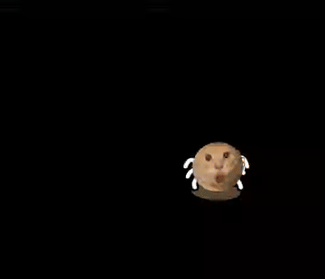

# pet-apps

桌面宠物 monorepo：Electron 悬浮壳 + 可嵌入 `createPetRuntime`。主入口是**系统桌面角上的小宠**，不是浏览器端口。

## 它是什么

这是一个常驻桌面的互动宠物：可以摸头、喂食、跳跃、拖动位置，也可以从托盘切换团子和圆头耄耋。

[查看最新版本记录](https://github.com/hellowmq/pet-apps/releases/latest) · 当前 Release 记录对应源码版本，仍需按下方命令运行，不是已签名安装包。

## 30 秒快速体验

```bash
npm ci
npm run desktop
```

启动后：

1. 看桌面右下角，确认团子已经出现。
2. 点击、拖动或右键团子，试试互动菜单。
3. 从托盘显示、隐藏或切换宠物。

## 运行效果




## 主入口（桌面）

正式入口是 `npm run desktop`。

默认出现在**屏幕右下角**（约 180×220），透明置顶。

需要 Node.js 22 或更新版本，建议使用 Node.js 24（见 `.nvmrc`）。安装依赖时需要联网下载 Electron。当前为源码运行的开发版本，尚未提供签名、安装包或自动更新；Windows / Linux 的桌面交互兼容性仍需实机验证。

**交互（桌宠）**
- 左键点宠物 → 摸头
- 按住拖宠物 → 移动位置（会记住）
- 右键宠物 → 摸头 / 喂食 / 跳跃 / 切换 / 隐藏 / 退出
- 空白穿透；菜单栏托盘可显示·隐藏·切换·退出

## 结构

```
apps/desktop        # Electron 桌宠（正式入口）
apps/tuanzi         # 浏览器整页调试
apps/maodie         # 浏览器整页调试
apps/showcase       # 可独立部署的互动展示页
packages/pet-core   # createPetRuntime / bond / particles / pageUi
```

## 调试页（可选）

```bash
npm run dev:tuanzi
npm run dev:maodie
```

带完整标题、亲密度、底栏按钮，方便拆看，**不是**桌宠形态。

## 互动展示页（本地）

```bash
npm run dev:showcase
npm run build:showcase
```

The showcase also exposes a compact, same-origin homepage widget at `?embed=maodie`.

静态产物在 `apps/showcase/dist/`，可作为独立站点部署。这里展示两只宠物的互动；桌面悬浮、拖动和托盘功能请运行正式桌面入口体验。

## 文档

- `docs/superpowers/specs/2026-09-08-desktop-pet-host-design.md`
- `docs/superpowers/specs/2026-09-08-desktop-pet-ux-revision.md`

## 开发检查

```bash
npm test              # 亲密度状态单元测试
npm run build:desktop # 只构建桌面渲染页面
npm run build         # 构建桌面页面和两个浏览器调试页
npm run check         # 测试 + 全部构建
```

依赖变更后用 `npm install` 更新并一并提交 `package-lock.json`；新环境使用 `npm ci` 复现锁定版本。构建页面不会生成可分发的桌面安装包。

## 首次入库范围

源码、宠物素材、设计文档、配置和依赖锁文件属于首版内容；`node_modules/`、`dist/`、日志和本地环境配置不入库。

代码采用 MIT License，详见 [LICENSE](LICENSE)。团子和圆头耄耋均为项目所有者自己的素材；团子当前通过 Three.js 几何体生成，耄耋使用项目内的 PNG 序列帧。桌面托盘主图标使用由 Apple Color Emoji 栅格化的 🍡 / 🐱 PNG，旧彩色圆点 PNG 仅作为图标缺失时的兜底；完整记录见[素材来源说明](docs/asset-sources.md)。MIT 适用于项目代码，素材归属另行记录，其他第三方素材仍需单独核验。

桌面验收需实际启动应用，逐项检查：两只宠物切换、摸头/喂食/跳跃、拖动与重启后位置恢复、空白鼠标穿透、托盘显示/隐藏/退出。单元测试与构建通过不能替代这些桌面体验检查。
